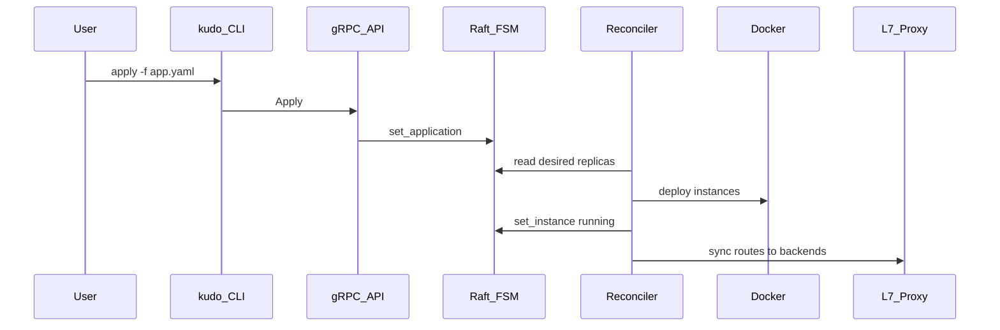

# Application Manifest Reference

Application manifests are YAML files consumed by `kudo apply` and `kudo remove`. Each document describes one **Application** resource.

Example: [`configs/examples/docker-app.yaml`](../configs/examples/docker-app.yaml)

## File format

```yaml
kind: Application    # optional; non-Application kinds are skipped
name: my-app         # required, unique in the cluster
adapter: docker      # required for workload runtime (see Adapters)
replicas: 2          # desired instance count (default 1 if omitted or 0)

spec:                # adapter-specific runtime settings
  # ...

routing:             # optional ingress / load balancing
  # ...
```

### Multi-application files

Separate documents with `---`:

```yaml
kind: Application
name: web
# ...
---
kind: Application
name: api
# ...
```

`kudo apply -f file.yaml` applies all documents. `kudo remove -f file.yaml` removes every app listed that exists in the cluster.

---

## Top-level fields

| Field | Required | Description |
|-------|----------|-------------|
| `kind` | No | Should be `Application`. Other kinds are ignored. |
| `name` | **Yes** | Stable application ID in the cluster. Used by `status`, `scale`, and `remove`. |
| `adapter` | **Yes** | Workload runtime. **`docker` is fully supported today.** `nodejs` / `python` are reserved names (see [Roadmap](#roadmap--not-yet-implemented)). |
| `replicas` | No | Desired running instances. Default `1`. The reconciler adds/removes containers over time. |

---

## `spec` (workload)

### Docker adapter (`adapter: docker`)

| Field | Required | Description |
|-------|----------|-------------|
| `spec.image` | **Yes** | Container image (e.g. `nginx:alpine`, `registry.io/app:v1.2.3`). Pulled on each new instance. |
| `spec.env` | No | Environment variables (`KEY: value` map). |
| `spec.entrypoint` | No | Parsed and stored; **not passed to Docker create today** (see roadmap). |
| `spec.directory` | No | Parsed and stored; **not passed to Docker create today** (see roadmap). |
| `spec.ports` | **Yes** (practical) | Port mappings (see below). At least one port is required for deploy to succeed. |

### `spec.ports`

Each entry is either a **shorthand integer** (container port only) or a **mapping object**.

**Shorthand**

```yaml
ports:
  - 80
```

Equivalent to container port `80`, ephemeral host port, no special ingress hint.

**Mapping object**

```yaml
ports:
  - port: 8080       # port the process listens on inside the container
    host: 0          # Docker host port: 0 or omit = random (recommended)
    public: 80       # hint: clients should use port 80 on the Kudo L7 proxy
```

| Subfield | Description |
|----------|-------------|
| `port` | **Required** on mapping objects. Container port (e.g. app listens on `8080`). |
| `host` | Optional fixed publish port on the Docker host. `0` or omitted = Docker assigns a free port (used as proxy backend). **Do not set `host: 80` on multiple replicas** — only one process can bind a given host port. |
| `public` | Optional. Sets `routing.ingress_port` if not already set. Documents that users reach the app via proxy port 80 (must match agent `proxy.http_port`). |

**Container port vs public port**

- **Container `port`** — what nginx/your app binds to *inside* the container.
- **Public / ingress** — TCP port on the **Kudo reverse proxy** (agent `proxy.http_port`, e.g. `80` in prod, `8088` in local dev without config).
- Traffic flow: `Client → Kudo proxy:80 → round-robin → 127.0.0.1:<ephemeral> → container:8080`.

Example (app on 8080, users hit port 80): [`configs/examples/docker-app-public-port.yaml`](../configs/examples/docker-app-public-port.yaml)

---

## `routing` (ingress)

| Field | Required | Description |
|-------|----------|-------------|
| `routing.domain` | Recommended | HTTP `Host` for L7 routing (e.g. `api.example.com`). Required for proxy registration in current implementation. |
| `routing.path` | No | URL path prefix key (default `/`). |
| `routing.ingress_port` | No | Documented target port on the Kudo proxy (e.g. `80`). Should match [`proxy.http_port`](configuration.md) on the agent. Logged as a hint if mismatched. |
| `routing.local_access` | No | If `true`, also register routes for `localhost` and `127.0.0.1` (local dev: `curl http://127.0.0.1:8088/`). |
| `routing.tls` | No | `auto` \| `manual` \| `off` — **stored only; TLS termination not implemented** (see roadmap). |
| `routing.algorithm` | No | `round-robin` \| `least-connections` — only **round-robin** is implemented in the proxy today. |
| `routing.healthcheck` | No | See below — **stored only; not enforced** by reconciler/proxy today. |

### `routing.healthcheck`

```yaml
healthcheck:
  path: /health
  interval: 10s
  timeout: 3s
  unhealthy_threshold: 3
```

| Subfield | Description |
|----------|-------------|
| `path` | HTTP path (stored in cluster state). |
| `interval` | Check interval (Go duration string). |
| `timeout` | Per-check timeout. |
| `unhealthy_threshold` | Failures before marking unhealthy (not applied yet). |

---

## How manifests become running containers



1. **`apply`** — writes `Application` to cluster state (leader only).
2. **Reconciler** (~10s) — compares running instances vs `replicas`; schedules deploy/stop actions.
3. **Docker adapter** — pull image, create/start container, record `127.0.0.1:<hostPort>` on the instance.
4. **Proxy sync** — backends = running instance addresses; route key = `domain` + `path`.

---

## `remove` and shared routes

`kudo remove` refuses to change anything if another application **still in the cluster** shares the same `routing.domain` + `routing.path` (unless that app is also in the remove file).

Include all apps that share an ingress route in one YAML when tearing down a stack.

---

## Validation rules (today)

- `name` must be non-empty.
- `replicas` defaults to `1` if `0` or omitted.
- Docker deploy fails without `spec.image` and without port mappings.
- Invalid YAML or unknown port list shapes return a parse error from `apply`.

---

## Roadmap / not yet implemented

Fields accepted in YAML but **not fully wired** today:

| Feature | Status |
|---------|--------|
| `adapter: nodejs` / `python` | No executor registered; use `docker` with your image |
| `spec.entrypoint`, `spec.directory` | Stored in state, not used by Docker adapter |
| `routing.tls` | Not implemented |
| `routing.algorithm: least-connections` | Only round-robin in proxy |
| `routing.healthcheck` | Not used for routing or restarts |
| `proxy.https_port` / HTTPS | Not implemented |
| Rolling updates / max surge | Not implemented |
| Resource limits (CPU/memory) | Not in schema |

See [Deploy a Web Application — TODO](deploy-web-application.md#production-gaps-todo) for production-oriented gaps.

---

## Related docs

- [CLI Usage](cli-usage.md)
- [Agent Configuration](configuration.md)
- [Deploy a Web Application](deploy-web-application.md)
